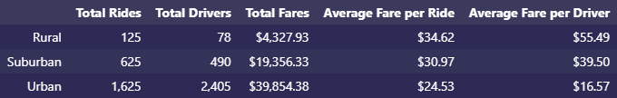
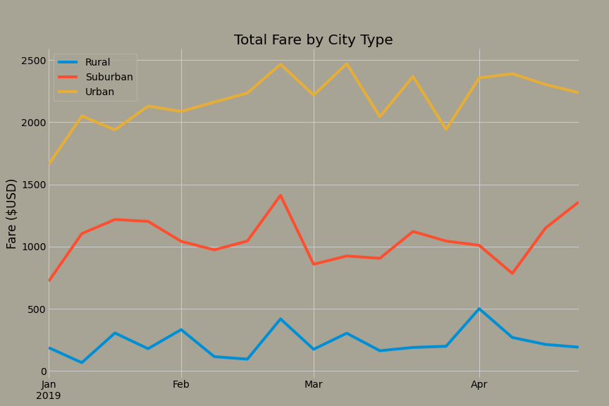

# PyBer Analysis

## Overview

The Q1 2019 fares for a ride-sharing company were compared by city type: urban, suburban, and rural. Summary statistics of rides, fades, and drivers were charted and total fares by city type were plotted per week. These comparisons suggest concentrating hiring campaigns in suburban or rural areas, rather than urban areas.

## Results

Population density appears to bring more rides, drivers, and overall fares, despite the lower fare per driver. The fare per ride is somewhat consistent across city types, especially compared to the other statistics.

Throughout Q1 2019, urban fares tended to be 10x as much as rural fares, and about 2x as much as suburban fares.

## Summary

Urban fares make up 63% of the total fares, and enticing much more urban growth may be a hard sell to drivers that would need to work twice as many fares as suburban drivers. Suburban fares offer promising growth potential, with 31% of total fares coming from 16% of the total drivers. Rural rides similarly showed more fares per driver, implying that each additional driver hired in these city types would earn around 2 - 3 times as many fares as would an urban driver.